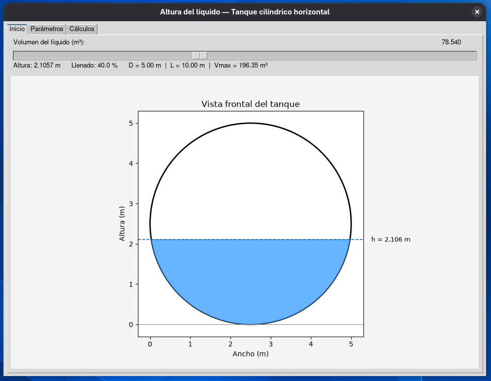
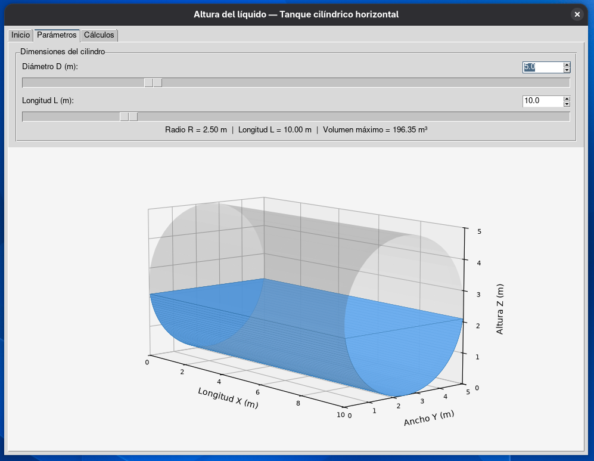
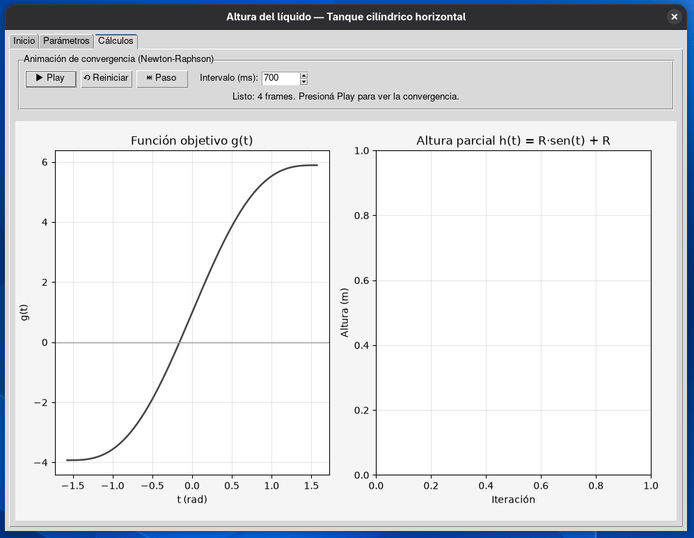

# tank-level-simulation
Python/Tkinter GUI tool for 3D visualization and variable-geometry level-volume calculations in horizontal cylindrical tanks using Newton-Raphson.

# Horizontal Tank Level & Volume Simulator


An interactive Python application designed for 3D visualization, variable geometry adjustments, and precise liquid level/volume calculations in horizontal cylindrical tanks.

---

## Key Features

* **Numerical Engine:** Fast and robust root-finding via the Newton-Raphson method applied to the circular segment area equation.
* **Graphical User Interface:** Built using Tkinter following a clean Model-View-Controller (MVC) architecture (`TanqueModel`).
* **3D Interactive Rendering:** Real-time orthographic/isometric 3D projection powered by Matplotlib.
* **Dynamic Geometry Scaling:** On-the-fly adjustment of diameter, length, and volume parameters while preserving fill percentage states.

---

## Tech Stack

* **Language:** Python 3
* **GUI Framework:** Tkinter / CustomTkinter
* **Data Processing & Plotting:** Matplotlib, NumPy

---

## Installation & Running

1. **Clone the repository:**
   ```bash
   git clone [https://github.com/Brian47-coder/tank-level-simulation.git](https://github.com/Brian47-coder/tank-level-simulation.git)
   cd tank-level-simulation

---

## Interfaz de la Aplicación

### 1. Vista Principal y Sección 2D (`Inicio`)


* **Control Deslizante de Volumen Interactivo:** Permite manipular en tiempo real el volumen de líquido ($m^3$) y el porcentaje de llenado.
* **Gráfico de Sección Transversal 2D:** Muestra la representación del segmento circular de la altura del fluido ($h$), mapeada dinámicamente según el diámetro del tanque.

---

### 2. Configuración de Parámetros 3D (`Parámetros`)


* **Controles de Geometría Variable:** Controles deslizantes y casillas numéricas interactivas para ajustar el Diámetro ($D$) y la Longitud ($L$) del tanque.
* **Renderizado 3D Ortográfico:** Visualización 3D en tiempo real utilizando una perspectiva isométrica para inspeccionar la distribución del volumen de líquido sin distorsión por punto de fuga.

---

### 3. Convergencia del Solvedor Numérico (`Cálculos`)


* **Análisis de la Función Objetivo:** Grafica $g(t)$ a lo largo del dominio del parámetro angular normalizado $t \in [-\pi/2, \pi/2]$.
* **Controles de Animación Paso a Paso:** Botones de reproducción, pausa, avance paso a paso y reinicio para visualizar en tiempo real la convergencia iterativa del método de Newton-Raphson.
